# Hex Map Builder — User Manual

A guide to building and evaluating Twilight Imperium async maps at
[stabar-ti.github.io/hex-Custom-async-ti-hyperlink](https://stabar-ti.github.io/hex-Custom-async-ti-hyperlink/)

---

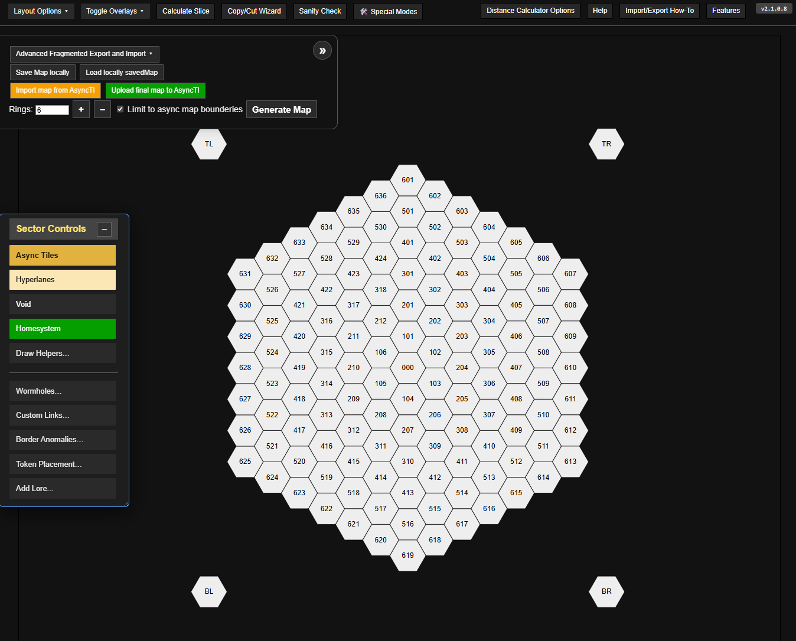
*Annotated screenshot: (1) top bar with action buttons, (2) controls panel with import/export, (3) hex grid with a populated map, (4) corner tiles TL/TR/BL/BR, (5) version tag top-right*

---

## 1. Getting started

### Global shortcuts

| Shortcut | Action |
|---|---|
| `Ctrl+Z` / `Cmd+Z` | Undo |
| `Ctrl+Shift+Z` / `Cmd+Shift+Z` | Redo |
| `Shift+R` *(hover a hex)* | Clear all content from that hex |
| `Esc` | Cancel current selection or exit current mode |

---

Open the tool in your browser. You'll see a hex grid representing your map. The interface is divided into:

- **Top bar** — quick-access buttons: Calculate Slice, Copy/Cut Wizard, Sanity Check, Special Modes, and overlay/layout options
- **Controls panel** (left) — import/export, map generation, and advanced tools
- **Hex grid** — the map itself; click any tile to interact with it
- **Corner tiles** (TL / TR / BL / BR) — special reference tiles outside the main grid

Green **?** question mark buttons appear throughout the interface — click them for contextual hints about that panel.

### Loading a map

There are two separate ways to load a map:

- **Load locally saved map** — loads a full JSON file you previously saved from this tool. Use this for work-in-progress maps.
- **Import map from AsyncTI** *(orange button)* — parses the map string format used by the AsyncTI Discord bot. Use this to load a map that is already live in an async game.

To start fresh, generate a blank grid by selecting a ring count and clicking **Generate Map**.

---

## 2. Draw Helpers

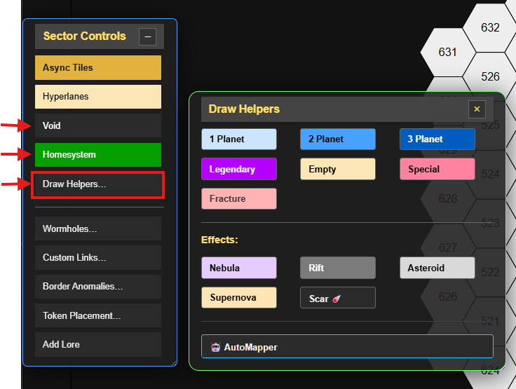
*The type buttons (1–3 Planet, Legendary, Empty, Special, Fracture) and effects row (Nebula, Rift, Asteroid, Supernova, Scar)*

Draw Helpers let you paint tile *types* and *effects* directly onto hexes without searching for a specific system. Open them from **Layout Options → Draw Helpers**. This is the fastest way to sketch out a map layout before assigning real systems.

### Tile types

Click a type button to activate that drawing mode, then click any hex to apply it:

| Button | Effect |
|---|---|
| **1 / 2 / 3 Planet** | Sets the hex as a planet tile with that many planets |
| **Legendary** | Marks the hex as a legendary planet tile |
| **Empty** | Sets an empty (non-planet, non-anomaly) hex |
| **Special** | Marks the hex as an anomaly/special tile |
| **Fracture** | Marks the hex as a Thunders Edge fracture tile (light red) |

### Effect overlays

Below the separator are effect buttons. These *add* a visual overlay on top of an existing tile rather than changing its type:

| Button | Effect |
|---|---|
| **Nebula** | Adds a nebula overlay |
| **Rift** | Adds a gravity rift overlay |
| **Asteroid** | Adds an asteroid field overlay |
| **Supernova** | Adds a supernova overlay |
| **Scar** | Adds an Entropic Scar overlay (Thunders Edge) |

### AutoMapper

At the bottom of the Draw Helpers popup is the **AutoMapper** button. After painting tile types onto your hexes using the type buttons above, AutoMapper automatically fills those hexes with real system tiles matching the types you painted. See section 10 for full details.

---

## 3. Hyperlane drawing

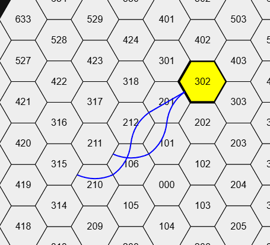
*Three adjacent hexes with a curved arc through the via tile (B), entry and exit edges highlighted*

Hyperlane connections are custom paths that pass *through* a tile rather than stopping at it. To draw them:

1. Open **Sector Controls** and click **Hyperlane mode**.
2. Click the tile *before* the via tile (A).
3. Click the via tile (B) — it is highlighted.
4. Click the tile *after* the via tile (C). A curved arc is drawn through B connecting A to C.

Repeat steps 2–4 to chain multiple segments through the same or different via tiles.

### Special hyperlane actions

- **Self-loop** — click A → B → A (start and end on the same tile) to draw a loopback arc on B. This means a ship can enter B from the A direction and be considered adjacent to A again.
- **Unlink** — hold **Alt** and click A → B → C to *remove* an existing connection.
- **Delete all segments on a tile** — hover over a via tile and press **Shift+R** to clear all hyperlane arcs on it.

### Hyperlane shortcuts

| Shortcut | Action |
|---|---|
| `Alt+click` A→B→C | Remove a single hyperlane connection |
| `Shift+click` (on a via tile) | Delete *all* hyperlane segments on that tile |
| `Shift+R` *(hover via tile)* | Same as Shift+click — clear all arcs on the tile |
| `Esc` | Cancel mid-path selection and start over |

> Hyperlane data is saved in the map JSON and restored on import.

---

## 4. Placing tiles — System Search

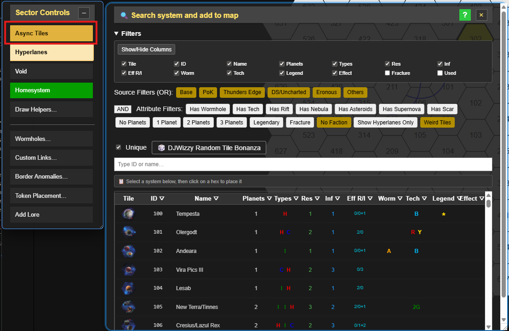
*The search popup with search box, source/attribute filters, AND/NAND toggle, and system list*

Once your layout is sketched out with Draw Helpers, use the system search to assign real tiles. Open it by clicking **Search system and add to map** (or the associated button in the controls panel).

### Finding a tile

- **Search by name or ID** — type the tile's name (e.g. "Mecatol") or its number to filter the list immediately.
- **Show/hide columns** — click column headers to toggle visibility and reduce clutter (e.g. hide the ID column if you're searching by name only).
- **Source filter** — restrict results to specific expansions. Toggle Base, PoK + Codex, Thunders Edge, Discordant Stars, or Eronous individually. At least one source must be active.
- **Attribute filters** — show only tiles with specific properties: wormholes, tech specialties, anomalies, planet count, or legendary planets.
- **AND / NAND toggle** — in **AND** mode, only tiles matching *all* active attribute filters are shown. In **NAND** mode, tiles matching *none* of them are shown — useful for finding "clean" tiles with no anomalies.
- **DJWizzy Random Tile Bonanza** — picks a random tile from the currently filtered list. Good for variety.

### Placing a tile

Select a tile from the list, then click the hex position where you want to place it. The tile's system data (planets, resources, influence, tech specialties, wormholes, anomalies) is applied to that hex. Any existing content in that hex is replaced.

> **Note:** Home-system tiles (faction homebases) are excluded from the search results by default.

---

## 5. Wormholes

Wormholes are placed and toggled from **Sector Controls → Wormholes**. Click the wormhole type (Alpha, Beta, Gamma, etc.) then click a hex to toggle that wormhole on or off.

Wormhole overlays are shown as coloured icons on the hex. The **Link Wormholes** button in the overlay options draws dashed lines between paired wormholes for visual reference.

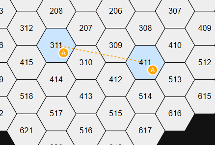
*Two hexes each showing an Alpha wormhole icon, connected by a dashed line*

---

## 6. Evaluating your map

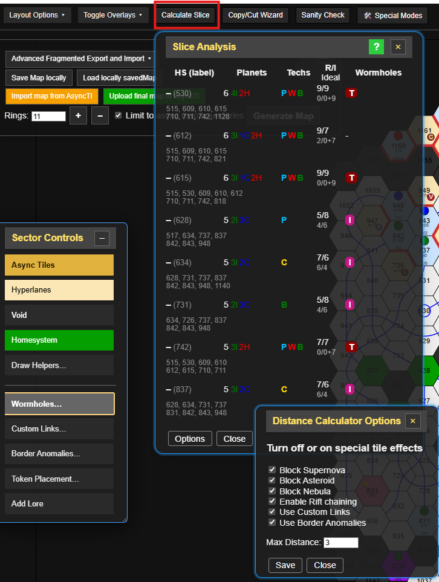
*Hex grid with distance rings around each home system, coloured highlights, and per-player score readout*

The **Calculate Slice** button (top bar) evaluates the value of each player's slice at your chosen distance setting.

- Set the evaluation distance under **Distance Calculator Options** (top bar, right side). Distance 2 is standard for most TI4 setups.
- Each player's home-system hex must have a tile placed (or its type set via Draw Helpers) for the calculation to include them.
- **Equidistant tiles** — tiles within evaluation distance of *two* home systems are counted toward both slices. These shared tiles are highlighted differently.
- The results show resources, optimal influence, tech specialties, and wormholes per slice.

> Run a **Sanity Check** (top bar) before finalising — it confirms there are no duplicate planet systems. Duplicates break the AsyncTI bot.

---

## 7. Distance calculation

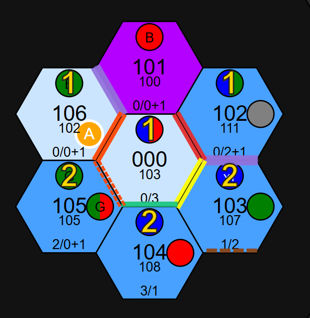
*Colour rings radiating from a selected tile, with an anomaly visually blocking one direction*

### Distance shortcuts

| Shortcut | Action |
|---|---|
| `Shift+D` | Toggle distance mode on/off |
| `Right-click` *(while Shift+D active)* | Calculate and display distance rings from that tile |

**Shift+D** activates distance mode. While active, **right-click any tile** to calculate distances from that tile as the source.

Coloured rings show how far each tile is. The calculation accounts for:

- **Anomalies** — supernovas and asteroid fields block outward movement. Nebulae block ships from leaving.
- **Gravity rifts** — ships can enter but rift clusters allow spreading with modified costs.
- **Hyperlanes** — paths through via tiles are calculated correctly.
- **Custom adjacency links** — manually connected tiles are treated as neighbours.
- **Border anomalies** — Spatial Tears block both ways; Gravity Waves allow one-way passage only.

Press **Shift+D** again to exit distance mode.

> Distance calculation is correct in virtually all cases. Certain unusual multi-hop hyperlane combinations near border anomalies may still produce edge-case results.

---

## 8. Adjacency overrides and border tokens

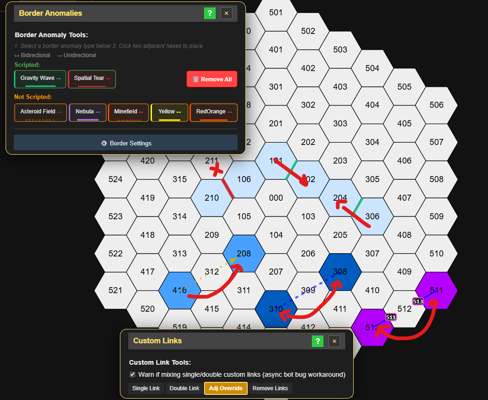
*Left: Spatial Tear (red line, blocks both ways). Right: Gravity Wave (arrow, one-way passage)*

### Custom links

A custom link manually connects two non-adjacent tiles as neighbours. Open **Sector Controls → Custom Links**, click the first tile, then the second. A dashed line is drawn between them. This is how you model "distant adjacency" such as a wormhole-style connection without using an actual wormhole overlay.

### Border anomalies

Border anomalies are placed *between* two adjacent tiles and affect movement across that edge. Open **Sector Controls → Border Anomalies**, select a type, then click two neighbouring hexes to place the anomaly on their shared border.

**Scripted types** (affect distance calculation):

| Type | Effect |
|---|---|
| **Spatial Tear** | Blocks movement in *both* directions across this border |
| **Gravity Wave** | Allows movement in *one direction* only (from the first tile clicked toward the second) |

**Visual-only types** (decoration, no game-mechanic effect): Asteroid, Nebula, Minefield, Arrow, and others — these appear on the map but do not affect distance calculations.

### Adjacency overrides

A third option adds a *bonus link* between two tiles on top of the existing grid — unlike a custom link which replaces normal adjacency, an override adds an extra connection while keeping the standard neighbours intact.

All adjacency data is saved in the map JSON and restored on import.

---

## 9. Overlays and display options

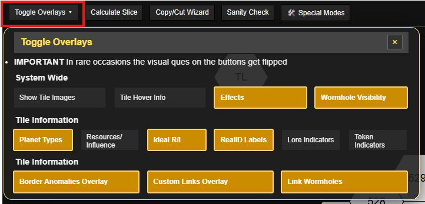
*The Toggle Overlays panel showing all available toggles with some active*

From **Layout Options** you can toggle visual overlays independently:

| Overlay | Shows |
|---|---|
| **Show Tile Images** | The actual tile artwork for assigned systems |
| **Planet Types** | Coloured circles per planet (blue = Cultural, green = Industrial, red = Hazardous) |
| **Resources / Influence** | Raw R/I numbers on each planet |
| **Ideal R/I** | The "optimal" value (milty-style flex calculation) |
| **RealID Labels** | The system ID number on each tile |
| **Border Anomalies** | The anomaly lines between tiles |
| **Custom Links** | The dashed custom-adjacency lines |

These overlays are independent — turn on only what you need.

---

## 10. AutoMapper

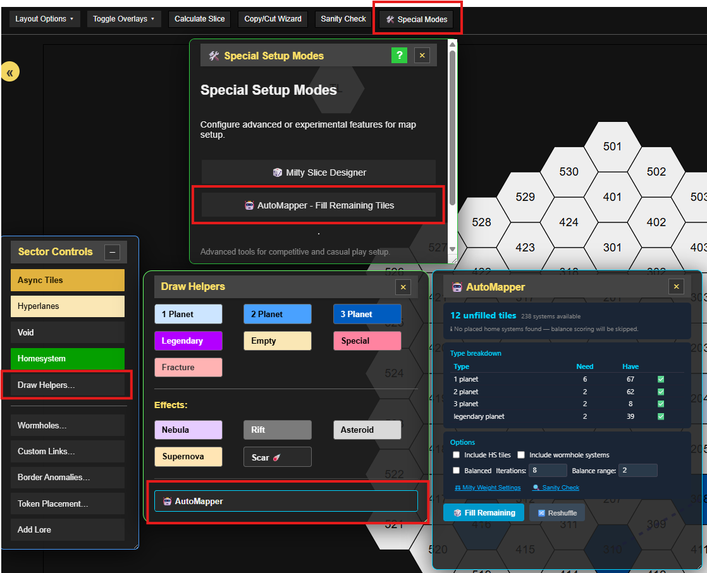
*Type breakdown table, options panel, Fill Remaining button, and preview list with orange token-fallback entries*

The AutoMapper fills unpainted hexes automatically using real system tiles from your source filter settings.

### Workflow

1. Use **Draw Helpers** (section 2) to paint tile types onto all the hexes you want filled.
2. Open **AutoMapper** from the Draw Helpers popup or from **Special Modes → AutoMapper**.
3. Check the **type breakdown table** — it shows how many hexes of each type need filling and how many real systems are available.
4. Choose your options and click **Fill Remaining**.
5. Review the preview, click **Reshuffle** for a different arrangement, then click **Apply to Map**.

### Options

- **Balanced mode** — runs multiple shuffles and keeps the assignment with the best resource spread across home-system slices. Uses the same scoring weights as the Milty Slice Designer.
- **Iterations** — how many shuffles balanced mode tries (more = slower but better result).
- **Balance range** — how far from each home system to consider when scoring balance (in hex distance).
- **Include HS tiles** — allows the mapper to fill home-system hexes (off by default).
- **Include wormhole systems** — includes tiles with wormholes in the pool (off by default; the mapper respects your source filters).

Tiles marked in **orange** in the preview will use an anomaly token rather than a real system tile (when no system matching both the type and the required effect is available).

---

## 11. Milty Slice Designer

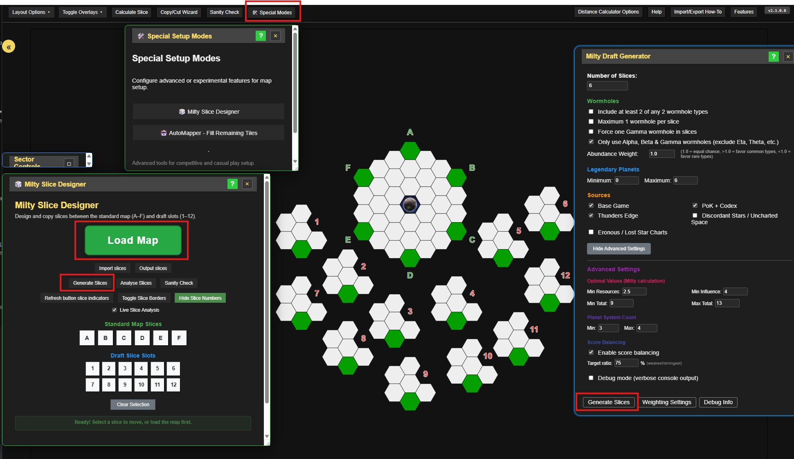
*The hex map with A–F slice overlays and 1–12 slot positions, Load Map button at top, Import/Output/Generate buttons below*

The Milty Slice Designer is a tool for setting up a competitive milty-style draft. Open it from **Special Modes → Milty Slice Designer**.

### Workflow

1. Click **Load Map** to import the current TI4 Milty Builder layout.
2. The map shows six slice positions (**A–F**) and twelve draft slots (**1–12**).
3. Click any slice letter or slot number, then click another to move that slice between positions.
4. When ready, click **Output Slices** to copy the slice data for use in your draft tool.

### Milty Draft Generator

Click **Generate Slices** to open the automated slice generator. Configure:

- **Number of slices** and **sources** (Base, PoK, Thunders Edge, etc.)
- **Wormhole constraints** — require at least two of any two wormhole types, max one per slice, force a Gamma wormhole
- **Legendary planet limits**
- **Advanced settings** — minimum optimal resources/influence, planet system count, score balancing target ratio

The generator produces balanced slices according to the weighting settings. Click **Weighting Settings** to adjust how resources, influence, tech skips, wormholes, legendary planets, anomalies, and trade stations are scored.

---

## 12. Token placement

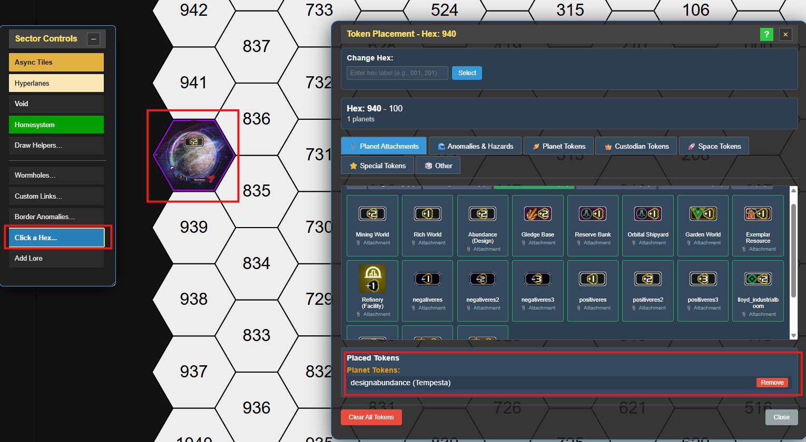

Tokens represent faction tokens, attachments, and anomaly markers placed on top of tiles.

Open **Sector Controls → Token Placement** and select a token from the categorised list, then click a tile to place it. Planet-level tokens (attachments) are placed on individual planets within a tile.

---

## 13. Copy/Cut Wizard

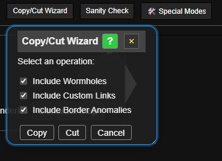
*Source selection step with highlighted hexes, and the target destination step*

The **Copy/Cut Wizard** (top bar) lets you copy or move a region of tiles to another part of the map.

1. Click **Copy/Cut Wizard** to open the tool.
2. Click the hexes you want to include (they are highlighted).
3. Confirm your selection, then click the destination hex to place the copied/cut tiles.

Cutting removes the tiles from their original positions. Copying leaves the originals intact.

### Copy/Cut shortcuts

| Shortcut | Action |
|---|---|
| `Shift+click` | Add a connected hex to the selection |
| Release `Shift` | Finish selection, enter paste preview mode |
| `Left-click` | Paste the selection at the previewed position |
| `Alt+scroll` *(in paste mode)* | Rotate the selection |
| `Esc` | Cancel the operation |

---

## 14. Exporting and importing

Your map is stored as a JSON object that captures all tile assignments, hyperlanes, wormholes, adjacency overrides, border anomalies, tokens, and lore.

### Saving work in progress

- **Save Map locally** — downloads the full JSON to your machine.
- **Load locally saved map** — loads a previously downloaded JSON.

### Sharing with the AsyncTI bot

- **Upload final map to AsyncTI** *(green button)* — formats and uploads the map for use in the AsyncTI Discord bot.
- **Import map from AsyncTI** *(orange button)* — loads an existing live game map back into the editor.

> **Always run the Sanity Check before uploading.** It verifies there are no duplicate planet systems — duplicates cause the bot to reject the map.

### Fragmented export (advanced)

The **Advanced Fragmented Export and Import** section allows exporting specific parts of the map separately:

- Map string (tile assignments only)
- Hyperlane positions
- Wormhole positions
- Custom adjacency links
- Border anomalies

This is useful if you want to preserve hyperlanes while changing only the system tiles, or vice versa.
